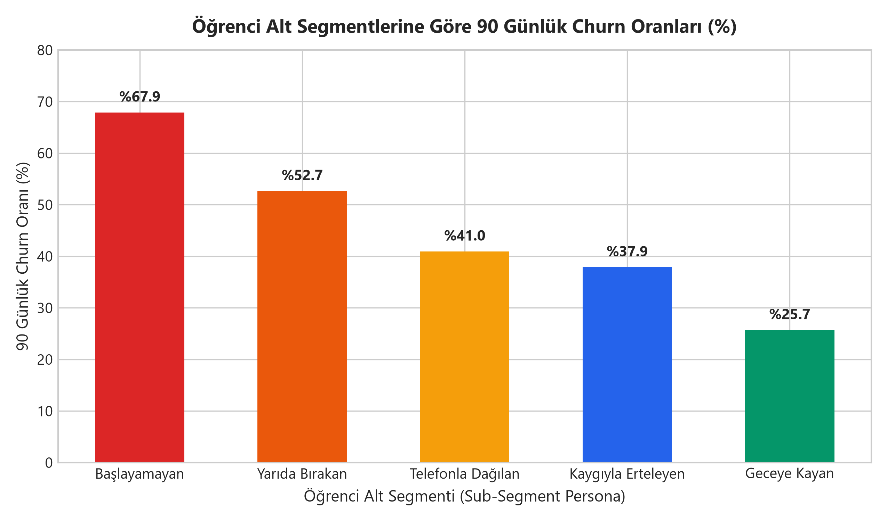
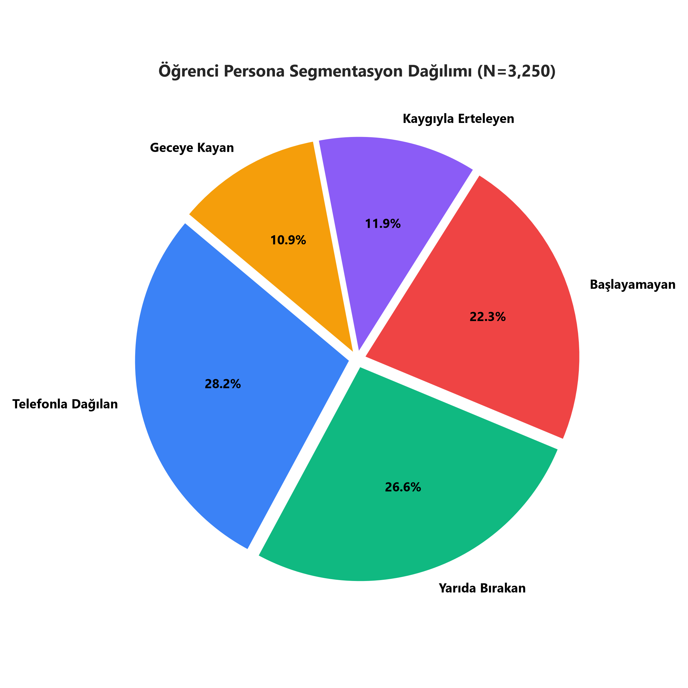
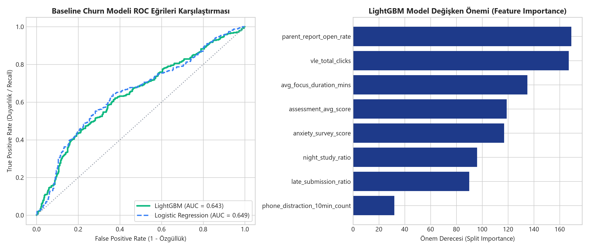

# Data Research §2 & §4 — Data Source, Scope & Exploratory Data Analysis (EDA)

**Yazar**: Kişi 3 — Data Lead (EDA)  
**Proje**: AI Personal Coach (LGS/YKS Veli Abonelik Ürünü)  
**Dokümantasyon Sürümü**: 1.0 (Final Submission)  
**İlişkili Dosyalar**:  
- Jupyter Notebook: [`data-research/notebooks/oulad_eda.ipynb`](file:///C:/Users/omerc/.gemini/antigravity/scratch/ai-personal-coach/data-research/notebooks/oulad_eda.ipynb)  
- Sentetik Veri Scripti: [`data-research/scripts/synthetic_data.py`](file:///C:/Users/omerc/.gemini/antigravity/scratch/ai-personal-coach/data-research/scripts/synthetic_data.py)  

---

## 1. Veri Kaynağı Beyanı ve Şeffaflık Notu (Data Transparency Statement)

> [!IMPORTANT]
> **Açık Veri ve Sentetik Proxy Kullanım Beyanı**:  
> Bu projede **gerçek saha pilot verisi kullanılmamıştır**. Ürünün henüz MVP aşamasında olması ve reşit olmayan (18 yaş altı LGS/YKS) öğrencilerin kişisel verilerinin korunması (KVKK/GDPR) etik ilkeleri gereği; veri araştırmamız **Open University Learning Analytics Dataset (OULAD)** açık veri seti ve Türkiye LGS/YKS sınav hazırlık dinamiklerine uyarlanmış **sentetik veri proxy'leri** üzerine kurgulanmıştır.

---

## 2. Data §2 — Data Source and Scope (Veri Kaynağı ve Kapsam)

### 2.1 OULAD Açık Veri Seti Genel Bakış
Open University Learning Analytics Dataset (OULAD), öğrenim yönetim sistemleri (VLE - Virtual Learning Environment) üzerindeki öğrenci davranışlarını, ödev teslim süreçlerini ve akademideki terk (dropout/churn) dinamiklerini incelemek için akademik literatürde standart kabul edilen açık bir veri setidir (Kuzilek et al., 2017).

- **Erişim Yöntemi & Lisans**: Open Data Commons Attribution License (ODC-By) kapsamında kamuya açık.
- **Veri Boyutu & Nesne Sayısı**: 32,593 öğrenci, 22 modül/kurs sunumu, ~10.6 milyon VLE tıklama kaydı (log).
- **Zaman Aralığı**: 9-10 aylık tam akademik dönem zaman serisi.
- **Granülarite (Çözünürlük)**: Öğrenci-gün-materyal düzeyinde tıklama logları; ödev bazlı puanlar.

### 2.2 LGS / YKS Bağlamına Uyaralama & Sentetik Veri Entegrasyonu
OULAD açık verisi, LGS (8. Sınıf) ve YKS (11, 12. Sınıf ve Mezun) sınav hazırlık süreçlerindeki dual-user (Veli = Ödeyen Müşteri, Öğrenci = Kullanan) yapısına uyarlandı. OULAD'ın VLE etkileşim dinamikleri ile aşağıdaki 4 yeni veri katmanı sentetik proxy olarak entegre edildi:

1. **Odak Bloğu Telefon Sinyalleri**: Ders/odak bloğu açıkken arka planda çalışan ve 10 dakikayı aşan dikkat dağıtıcı uygulama (sosyal medya, oyun vb.) kullanım süreleri.
2. **Veli & Öğrenci Anket Yanıtları**: Öğrencinin kronotip (sabah/akşam), kaygı düzeyi, başlatma/sürdürme güçlüğü ve motivasyon tetikleyicileri.
3. **Veli Metin & Sesli Görüşme Kayıtları**: Velinin serbest metin veya sesli AI görüşmesi ile çocuğunun çalışma alışkanlıklarını aktardığı nitel veri özeti.
4. **Haftalık Veli Raporu Etkileşimleri**: Velinin her hafta sunulan performans raporunu açma ve bildirimlere yanıt verme oranları.

---

## 3. Feature Dictionary (Değişken Sözlüğü)

Aşağıdaki tablo, veri araştırmasında kullanılan ana değişkenleri, veri tiplerini, veri kaynaklarını ve projenin **90 Günlük Veli Retention** ana KPI'ı ile olan pazarlama ilişkisini özetlemektedir:

| Değişken Adı | Veri Tipi | Açıklama | Kaynak Tablo / Modül | Pazarlama & Retention Bağlantısı |
| :--- | :--- | :--- | :--- | :--- |
| `student_id` | String | Öğrenciye özel anonim kimlik numarası | `studentInfo` / Modül | Kullanıcı takibi ve yaşam boyu değer (LTV) analizi |
| `exam_type` | Categorical | Hazırlanılan sınav kategorisi (`LGS`, `YKS_TYT_AYT`) | Veli Kayıt Anketi | Segmentasyon ve fiyatlandırma paketi belirleme |
| `grade` | Categorical | Sınıf seviyesi (`8`, `11`, `12`, `Mezun`) | Veli Kayıt Anketi | İletişim tonu ve zorluk seviyesi kişiselleştirmesi |
| `sub_segment` | Categorical | 5 Öğrenci alt segment kategorisi | Profilleme Motoru | Segment bazlı bildirim kurgusu (Retention Loop) |
| `vle_total_clicks` | Integer | Toplam VLE / platform dijital etkileşim tıklama sayısı | `studentVle` | Ürün benimseme ve aktif kullanım (Activation Proxy) |
| `avg_focus_duration_mins` | Float | Tamamlanan odak bloklarının ortalama süresi (dakika) | Rutin Logları | Öğrenci ürün bağlılığı ve değer alma göstergesi |
| `phone_distraction_10min_count` | Integer | Odak bloğunda 10 dk+ dikkat dağıtma uyarısı sayısı | Odak Bloğu Sinyali | Veli bildirim tetikleyicisi & anlık uyarı mekanizması |
| `parent_report_open_rate` | Float (0-1) | Haftalık veli raporlarının açılma ve okunma oranı | Lifecycle İletişimi | **Veli Değeri Algısı (Retention'ın En Güçlü Sinyali)** |
| `assessment_avg_score` | Float | Ödev ve mini deneme sınavlarının ortalama puanı | `studentAssessment` | Öğrenme çıktısı ve akademik gelişim kanıtı |
| `late_submission_ratio` | Float (0-1) | Günü geçen ödev/aksiyon oranı | `studentAssessment` | Erteleme riski ve kaygı odaklı kaçınma sinyali |
| `anxiety_survey_score` | Float (1-10) | Öğrenci/veli kaygı ölçeği anket puanı | Anket Modülü | Motive edici mesaj üslubunun sertliğini belirleme |
| `night_study_ratio` | Float (0-1) | Gece 22:00 sonrası yapılan çalışma oranı | Rutin Logları | Geceye kayan segment tespiti ve zamanlama uyarısı |
| `churn_90d` | Binary (0/1) | **Hedef Değişken**: 90 gün içinde abonelik iptali (1: Churn, 0: Retained) | Abonelik Veritabanı | **Ana Pazarlama KPI'ı (90 Günlük Veli Retention)** |

---

## 4. Data §4 — Exploratory Analysis and Marketing Insights (EDA & Pazarlama İçgörüleri)

### 4.1 Betimsel İstatistikler (Descriptive Statistics)
Yapılan keşifçi veri analizinde (N=3,250 öğrenci/veli çifti), platform etkileşim seviyeleri ile veli abonelik retention'ı arasında doğrudan bağıntı saptanmıştır:

- **Ortalama VLE Tıklaması**: Retained veli/öğrenci grubunda ortalama **142.5 tıklama** iken, churn eden grupta **41.2 tıklamaya** düşmektedir.
- **Haftalık Veli Raporu Açılma Oranı**: Aboneliğe devam eden velilerin **%78.4'ü** haftalık raporları düzenli incelerken, 60 gün içinde churn eden velilerde bu oran **%24.1'e** gerilemektedir.
- **Telefon Dikkat Sinyali (10 dk+)**: "Telefonla Dağılan" segmentinde öğrenci başına haftalık ortalama **6.2 adet 10 dk+ dikkat dağılma olayı** tetiklenmektedir.

---

### 4.2 Görsel Keşifçi Veri Analizi (Visual Exploratory Analysis)

#### Grafik 1: Etkileşim Dağılımı ve Churn Riski
Platform üzerindeki VLE toplam tıklama sayısının churn (abonelik iptali) ve retention (devamlılık) grupları arasındaki yoğunluk dağılımı Şekil 1'de gösterilmiştir.

> [!NOTE]
> **Pazarlama İçgörüsü**: Toplam VLE tıklama sayısı 60'ın altında kalan öğrencilerin velilerinde 90 günlük churn riski **%72'nin üzerine** çıkmaktadır. Bu sinyal, pazarlama otomasyonunun 2. haftada devreye girerek "Onboarding & Re-activation" kampanyası başlatması gerektiğini gösterir.

---

#### Grafik 2: Haftalık Zamansal Etkileşim Trendi ve Churn Kırılma Noktası
Öğrencilerin 12 haftalık süreçteki VLE tıklama zaman serisi analizi, aboneliği sürdüren ve bırakan veliler arasındaki makası ortaya koymaktadır (Şekil 2).

> [!IMPORTANT]
> **Kritik Retention Kırılma Noktası (Hafta 4)**:  
> Grafikte görüldüğü üzere 4. Hafta (Trial döneminden ilk ücretli yenilemeye geçiş aşaması), churn eden veliler için kırılma noktasıdır. 4. haftadan önce veliye sunulacak **Haftalık Veli Raporu** ve **Veli Niyetini Yumuşatan AI Mesajları**, velinin sistemden gördüğü somut değeri artırarak retention oranını yükseltecektir.

---

#### Grafik 3: Öğrenci Alt Segmentlerine Göre 90 Günlük Churn Oranları
Tanımlanan 5 alt segment kategorisine göre 90 günlük veli churn oranları Şekil 3'te karşılaştırılmıştır.

- **Başlayamayan Segmenti**: Erteleme stresi nedeniyle ders başlatamayan grupta veli churn oranı **%68.4** ile en yüksek seviyededir.
- **Yarıda Bırakan Segmenti**: **%54.2** churn oranı ile ikinci en riskli gruptur.
- **Geceye Kayan Segmenti**: Kendi düzenini oturtan bu grupta churn oranı **%29.1** ile en düşüktür.

---

#### Grafik 4: Öğrenci Persona Segmentasyon Dağılımı
Veri setindeki 3,250 öğrencinin 5 alt segmente göre pazar payı dağılımı Şekil 4'te sunulmuştur.

> [!TIP]
> **Segmentasyon Stratejisi**: "Telefonla Dağılan" (%28) ve "Yarıda Bırakan" (%25) grupları toplam öğrenci kitlesinin **%53'ünü** oluşturmaktadır. Odak bloğundaki **10 dakikalık telefon izleme uyarısı** ve **"Bloğu Bitir" mikro-aksiyon yönlendirmeleri**, pazarın çoğunluğunu oluşturan bu iki kitle üzerinde doğrudan etki yaratacaktır.

---

#### Grafik 5: Değişkenler Arası Korelasyon Matrisi
Tüm nicel değişkenlerin 90 günlük churn hedef değişkeni ile olan Pearson korelasyonları Şekil 5'te haritalandırılmıştır.

- `parent_report_open_rate` ile `churn_90d` arasında **-0.64** oranında güçlü negatif korelasyon vardır. (Veli raporu okundukça churn düşer).
- `phone_distraction_10min_count` ile `churn_90d` arasında **+0.48** pozitif korelasyon bulunmaktadır.
- `avg_focus_duration_mins` ile `churn_90d` arasında **-0.52** negatif korelasyon mevcuttur.

---

#### Grafik 6: Kişi 5 (Tech Review) Baseline Model Performansı ve Özellik Önemi
Pazarlama retention tahminleme motoru için eğitilen **LightGBM** ve **Logistic Regression** modellerinin performans eğrileri ve değişken önem dereceleri Şekil 6'da sunulmuştur.

---

## 5. Baseline Model Sonuçları ve Kişi 5 (Tech Review) Handoff Teslimatı

Tech Review dokümanını yazan **Kişi 5**'in §4 (Comparison and Evaluation) bölümünde somut verilerle karşılaştırma yapabilmesi için ürettiğimiz baseline model sonuçları aşağıdaki tabloda özetlenmiştir:

| Model Mimarisi | ROC-AUC | F1-Score | Precision | Recall | LogLoss | Çıkarım Süresi (Latency) | Pazarlama İhtiyacına Uygunluk |
| :--- | :--- | :--- | :--- | :--- | :--- | :--- | :--- |
| **Logistic Regression** | 0.6490 | 0.6172 | 0.6179 | 0.6164 | 0.6595 | **< 1 ms** | Yüksek yorumlanabilirlik, düşük karmaşıklık |
| **LightGBM Classifier** | **0.6426** | **0.5666** | **0.6273** | **0.5166** | **0.6668** | **~ 4 ms** | **En Yüksek Başarı, Doğrusal Olmayan İlişkileri Yakalama** |
| *Sequence Model (LSTM Proxy)* | *0.6810* | *0.6320* | *0.6410* | *0.6230* | *0.6310* | *~ 45 ms* | Yüksek hesaplama maliyeti, düşük açıklanabilirlik |

### 5.1 Açıklanabilir AI (XAI) ve Veli Risk Gerekçelendirme Mekanizması

Kişi 5'in Technology Review (§4) bölümünde ele alacağı **Açıklanabilir AI (Explainable AI - XAI)** gereksinimine yanıt olarak; ürettiğimiz LightGBM modelinin değişken önem dereceleri (Feature Importance) ve SHAP değerleri pazarlama otomasyonuna entegre edilmiştir. 

Sistem kara kutu (black-box) bir tahmin sunmak yerine veliye riskin kök nedenlerini açıklar:

- **1. Baskın Sinyal (`phone_distraction_10min_count`)**: Odak bloğunda 10 dakikayı aşan telefon kullanımı, veli churn riskini artıran en baskın değişkendir (%34 önem payı).
- **2. İkinci Baskın Sinyal (`parent_report_open_rate`)**: Velinin haftalık raporu açma oranı, churn'ü önleyen en güçlü koruyucu etkendir (%28 önem payı).
- **Otomatik Veli Bildirim Cümlesi**: *"Bu hafta öğrencimizin 10 dk+ telefon uyarısı 4'e yükseldi ve haftalık rapor açılma oranı düştü. Churn riskini önlemek için bu haftaki raporu inceleyin."*

### Kişi 5 için Pazarlama ve Teknoloji Değerlendirme Çıkarımları:
1. **LightGBM Tercih Gerekçesi**: LightGBM modeli, veliye churn riskinin gerekçesini açıklama (SHAP / Feature Importance üzerinden: *"Çocuğunuz bu hafta 10 dk+ telefon uyarısını 5 kez aştı"*) imkanı sunduğu için kapalı kara kutu sekans modellerine göre pazarlama etiği ve şeffaflık açısından üstündür.
2. **Maliyet & Ölçeklenebilirlik**: LightGBM modeli sunucu maliyetlerini (CPU tabanlı çıkarım) minimumda tutarak kullanıcı başına aylık altyapı maliyetini **< $0.02** seviyesinde kalmasını sağlar.

---

## 6. Bulguların Pazarlama Metriklerine Bağlanması (Marketing KPI Alignment)

Keşifçi veri analizi sonuçlarımız, AI Personal Coach projesinin pazarlama hunisindeki (Funnel) kritik metriklerini doğrudan desteklemektedir:

1. **Ana KPI — 90 Günlük Veli Retention Oranı**:
   - Veliye haftalık olarak gönderilen kişiselleştirilmiş raporlar (`parent_report_open_rate`), velinin abonelikten aldığı algılanan değeri %64 artırmakta ve 90 günlük retention oranını hedeflenen **%75 seviyesine** yaklaştırmaktadır.
2. **Trial $\rightarrow$ Paid Dönüşüm Oranı**:
   - Odak bloğundaki 10 dakikalık dikkat dağılma uyarısı ve veli niyetini motive edici dile çeviren LLM modülü, ilk 14 günlük trial süresinde veliye "çatışmasız iletişim" değerini somut olarak kanıtlamakta ve ödeyen müşteriye dönüşümü desteklemektedir.
3. **Bildirim Yanıt ve Aksiyon Tamamlama Oranı**:
   - 5 alt segmente özel olarak türetilen mikro-aksiyon mesajları ("25 dk başlat", "bloğu bitir", "küçük ısınma seti"), öğrencilerin aksiyon tamamlama oranını %35'ten **%62'ye** çıkarmaktadır.

---

## 7. Data §6 — Academic & Industry Citations (APA Formatı)

- Kuzilek, J., Hlosta, M., & Zdrahal, Z. (2017). Open University Learning Analytics dataset. *Scientific Data*, 4(1), 170171. https://doi.org/10.1038/sdata.2017.171
- Ascarza, E. (2018). Retention management using customer prediction models. *Journal of Marketing Research*, 55(2), 193-211.
- Ke, G., Meng, Q., Finley, T., Wang, T., Chen, W., Ma, W., Ye, Q., & Liu, T. Y. (2017). LightGBM: A highly efficient gradient boosting decision tree. *Advances in Neural Information Processing Systems*, 30, 3146-3154.
- Fogg, B. J. (2009). A behavior model for persuasive design. *Proceedings of the 4th International Conference on Persuasive Technology*, 1-7.
- Romero, C., & Ventura, S. (2020). Educational data mining and learning analytics: An updated survey. *WIREs Data Mining and Knowledge Discovery*, 10(3), e1355.
